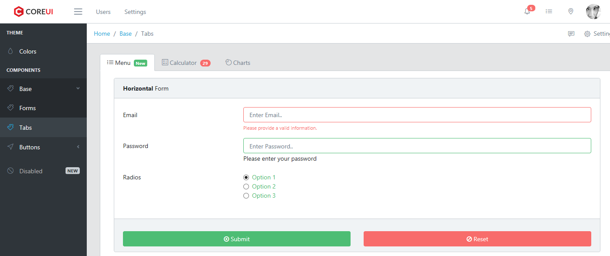

# TEMPERATURE REST + ANGULAR

Прикрутили логгирование в файл и в консоль
 
 
### Что сделано:

* Прикрутили логгирование в файл и в консоль

### Что надо сделать:

* Трейсить все ошибки через все приложение, пробросить везде Try - catch
* Доделать фронтенд
* Можно еще сделать отправку логов/состояний на почту.
* Поменять название проекта
* Поменять названия классов и переменных
* Поменять адрес REST API
* Прикрутить телеграмм-бота
* Перейти со Спринга на СпрингБут
* Надо поменять еще вот эту ссылку - http://localhost:8080/FirstSPRINGJDBC-2.0-SNAPSHOT/rest/api/add. Чо за ФёрстСпрингДжейДиБиСи ????!!!!!!!
* Прикрутить экран к ардуине
* Нужно логгировать и за-трай-кетчить все ошибки, чтобы я их видел потом в боте
* Прикрутить лампочки и вывод инфы (например, флаги) на OLED.
* Temperature_copy переименовать в нормальную
* Переименовать и перенести все модели в Ангуляре, например что за User.ts - ????
* Переименовать и перенести переменные (Ангуляр) (this.year и this.count)
* Переименовать методы типа addlog3. Ну что это за пипец.....
* Сделать отправку логов/состояний на почту
* Почистить гит, слить все ветки в мастер и удалить
* Убрать ненужные депенденси
* Надо бы еще в логи прям ситуацию словами постить и может быть даже метод такой сделать, чтобы жто получать.

### Скриншот

